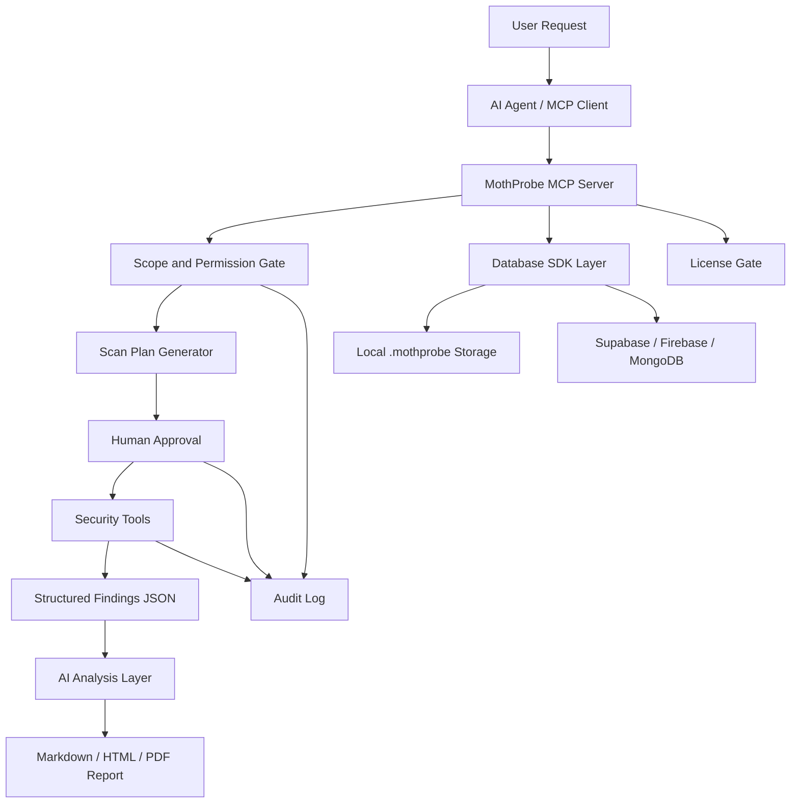

# MothProbe

MothProbe is an AI-assisted penetration testing and cybersecurity assessment tool for discovering vulnerabilities, scanning attack surfaces, collecting OSINT digital footprint data, and turning raw findings into clear remediation guidance.

The project is built for authorized security work: internal security audits, bug bounty preparation, red-team support, blue-team validation, compliance checks, and defensive research. It is not intended for unauthorized access, exploitation, or abuse.

## Goals

- Help security teams find and understand vulnerabilities faster.
- Combine scanning, OSINT, and security analysis in one workflow.
- Use AI to explain findings, reduce noise, prioritize risk, and generate reports.
- Keep human approval, scope control, and audit logs at the center of every active scan.
- Support local and cloud AI providers without locking the project to one vendor.

## Planned Capabilities

### Scanning and Enumeration

- TCP and UDP port scanning.
- Host discovery and ping sweep.
- Banner grabbing and service fingerprinting.
- HTTP header and web security checks.
- TLS and certificate configuration checks.
- Technology detection for web applications and exposed services.

### Vulnerability Analysis

- CVE lookup by product, version, and service fingerprint.
- Severity scoring and prioritization.
- False-positive reduction using contextual analysis.
- Evidence collection for each finding.
- Remediation recommendations written for engineers.

### OSINT and Digital Footprint

- Domain and subdomain discovery.
- DNS record inspection.
- Public IP and ASN mapping.
- Email, organization, and exposed metadata collection from approved sources.
- Public web surface mapping.
- Leak, exposure, and misconfiguration indicators where legally accessible.

### AI-Assisted Workflow

- Scan plan generation from a natural-language request.
- Scope and permission validation before tools run.
- Human approval before active scanning.
- Structured JSON findings for LLM analysis.
- Explainable summaries, risk ranking, and report generation.
- Optional integration with local or cloud LLM providers.

### Database, Sync, and Licensing

- Local-first project data stored under `.mothprobe/` for community workflows.
- Future database SDK layer for Supabase, Firebase, MongoDB, and self-hosted backends.
- Optional cloud sync for teams that need shared projects, reports, and audit history.
- License-key enforcement for Professional features without blocking the Community edition.
- Clear Community limits for commercial sustainability while keeping the core tool usable.

## Safety Model

MothProbe should be safe by design:

- Explicit target scope is required before active scanning.
- Dangerous or intrusive actions require human approval.
- Commands and tool arguments must be validated before execution.
- All scans should be logged for auditability.
- Output should distinguish confirmed findings from assumptions.
- Secrets and sensitive target data should not be sent to cloud AI providers unless the user explicitly enables it.

## Architecture

The planned architecture centers on a C++ MCP server:



## Editions

MothProbe is planned as a sustainable open-core product:

### Community Edition

- Local-only usage.
- Single-user workflows.
- Limited scan concurrency and project count.
- Basic MCP tools, local audit log, and manual report export.
- Community support and transparent responsible-use guardrails.

### Professional Edition

- License-key activation.
- Higher scan concurrency and larger projects.
- Team/database sync through supported backends.
- Advanced report templates and export automation.
- Longer chat/session memory retention.
- Provider and model management for production workflows.
- Priority security updates and commercial usage features.

License checks should be implemented in the C++ MCP backend so privileged capability decisions stay auditable and cannot be bypassed by changing the TypeScript UI.

## Current Status

MothProbe is in early foundation stage. The repository currently focuses on the TypeScript terminal client, C++ MCP backend, dependency integration, smoke tests, MCP tool registry, LLM provider routing, and the roadmap for the security tool engine.

Implemented foundation pieces include:

- CMake project setup.
- C++ dependency integration.
- Catch2 smoke tests.
- Static runtime configuration for MSVC builds.
- TypeScript/Ink terminal client direction.
- JSON-RPC stdio connection to the C++ MCP backend.
- Runtime layout under `.mothprobe/`.
- Early LLM provider configuration and MCP routing.

Major work still pending:

- Production-grade scope validation and approval workflow.
- Real scanning modules.
- OSINT collectors.
- Database SDK layer and team sync.
- License-key activation and edition gating.
- Report generation.

## Build

```powershell
cmake -S . -B build
cmake --build build
```

For Visual Studio multi-config builds, run tests with an explicit configuration:

```powershell
ctest --test-dir build -C Debug -R SmokeTest --output-on-failure
```

## Repository Layout

```text
src/                 Application and test source code
client/              TypeScript/Ink terminal client
tests/               Future integration and protocol tests
cmake/toolchains/    Cross-compilation toolchain files
.mothprobe/          Local runtime data, config, caches, memory, and logs
third_party/         Vendored dependencies and submodules
TODO.md              Development roadmap
```

## Ethics and Authorization

Use MothProbe only against systems you own or have explicit permission to assess. The project should prioritize defensive security, responsible disclosure, privacy, and explainable evidence over aggressive automation.

## Long-Term Vision

MothProbe aims to become a trusted AI-powered cybersecurity platform for vulnerability assessment, security auditing, OSINT-driven exposure mapping, compliance validation, and defensive operations.
