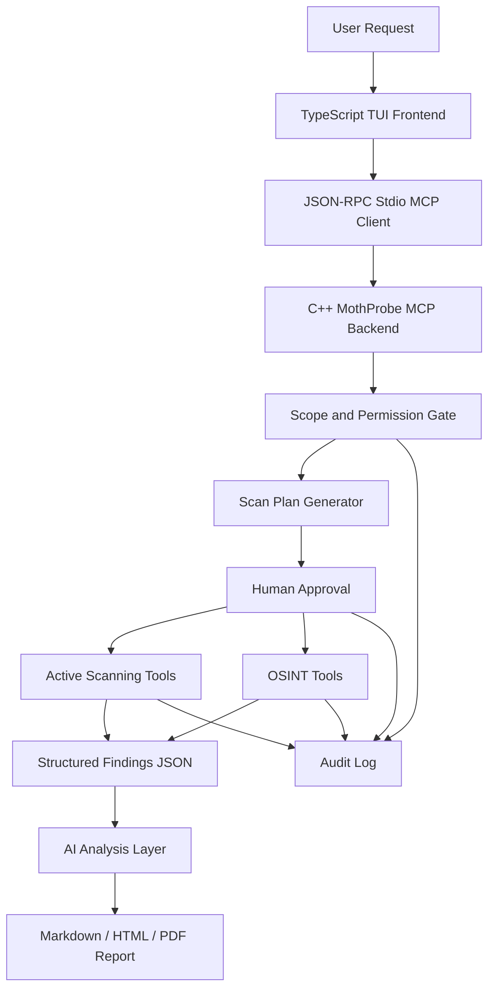

# MothProbe Roadmap & TODO

MothProbe is an AI-assisted penetration testing and cybersecurity assessment platform. It combines authorized scanning, OSINT digital footprint collection, vulnerability analysis, AI-assisted prioritization, and report generation.

The product architecture is split into a TypeScript terminal frontend and a C++ MCP backend. The TypeScript TUI owns the interactive user experience, onboarding, chat workflows, and command palette. The C++ `mothprobe_mcp` daemon owns JSON-RPC/MCP transport, safe tool execution, runtime layout, cache access, scope validation, and auditable security operations.

---

## Phase 1: Foundation and Build System

Set up a stable C++ base that can support protocol handling, scanning tools, OSINT collectors, and provider integrations.

- [x] Compiler and build setup
  - [x] Configure CMake project.
  - [x] Integrate MSVC / Clang-CL compatible build settings.
  - [x] Enable static runtime linking for standalone Windows builds.
  - [x] Standardize the project on C++20.
- [x] Dependency setup
  - [x] `fmt` for formatting.
  - [x] `spdlog` for logging.
  - [x] `nlohmann_json` for JSON handling.
  - [x] `Catch2` for tests.
  - [x] `toml++` for configuration.
  - [x] `cpp-httplib` for HTTP clients and test servers.
  - [x] `libsodium` for cryptographic utilities.
  - [x] Removed the legacy FTXUI C++ TUI implementation; production frontend direction is TypeScript.
- [/] TypeScript TUI Frontend Client
  - [x] Initialize TypeScript + Node.js project for the TUI frontend under `frontend/`.
  - [ ] Integrate TUI libraries like **Ink** (React for CLIs) or **neo-blessed** for richer rendering.
  - [x] Implement stdio-based MCP client to spawn and communicate with `mothprobe_mcp` C++ backend.
  - [ ] Implement onboarding experience and LLM provider configuration directly in TypeScript (easier SDK integrations).
  - [ ] Design a terminal UI experience inspired by Claude Code, Codex, OpenCode, and similar agentic coding/security tools.
  - [x] Build a TypeScript CLI/TUI entry point (`mothprobe-tui` script).
  - [/] Add a chat-oriented main panel for user prompts, AI responses, and scan explanations.
  - [ ] Add a live tool activity panel showing MCP calls, scanner status, OSINT collectors, progress, and errors.
  - [ ] Add an approval panel for scope confirmation, active scan authorization, and risky tool prompts.
  - [ ] Add a findings panel for vulnerabilities, OSINT records, severity, confidence, and evidence.
  - [ ] Add a logs and audit view for daemon messages without mixing logs into MCP stdout.
  - [ ] Add keyboard-first navigation, command palette, scrollback, copy/export actions, and status bar.
  - [ ] Add TUI input modes:
    - [/] `/` opens the command list / command palette.
    - [x] `/command` executes an internal MothProbe command.
    - [x] `!` switches the prompt into shell input mode.
    - [x] `!command` executes a shell command through the approved local shell runner.
    - [ ] `@` opens file picker / file mention suggestions.
    - [x] `@path/to/file` attaches the selected file as context for the MothProbe agent.
    - [/] Show clear mode indicators for chat, command, shell, and file-context input.
    - [/] Require approval or policy checks before running shell commands.
    - [x] Log command, shell, and file-context events into the audit trail.
  - [ ] Add session browser support for histories stored in `.mothprobe/brains/`.
  - [ ] Add cache inspection support for `.mothprobe/caches/`.
  - [ ] Define visual states for idle, thinking, scanning, waiting for approval, error, cancelled, and completed.
  - [ ] Add TUI smoke tests for layout rendering and basic keyboard events.
- [ ] Build hygiene
  - [ ] Disable third-party test registration in normal project test runs.
  - [ ] Add a project-only test target.
  - [ ] Add GitHub Actions for Windows, Linux, and macOS.
  - [ ] Add release build configuration and artifact packaging.
- [ ] Configuration
  - [/] Define `data/.mothprobe/config.toml` schema.
  - [/] Add config loader with validation and defaults.
  - [x] Add environment variable override support.

---

## Phase 2: MCP Daemon, Runtime Layout, and JSON-RPC Transport

Build the MCP daemon and runtime layer that lets AI agents call MothProbe tools safely. The daemon should own protocol handling, tool orchestration, cache access, and chat history persistence.

- [/] Runtime directory contract
  - [x] Define `.mothprobe/bin/` as the location for the MCP daemon binary and supporting tool binaries.
  - [x] Define `.mothprobe/caches/` as the MCP server cache directory.
  - [x] Define `.mothprobe/brains/` as the chat history and AI session memory directory.
  - [x] Add startup validation that creates missing runtime directories.
  - [ ] Add config keys for overriding runtime paths when needed.
  - [ ] Document expected file ownership, permissions, and cleanup behavior.
- [/] MCP daemon binary
  - [x] Build `mothprobe_mcp` as the main MCP server daemon.
  - [x] Install or copy `mothprobe_mcp` into `.mothprobe/bin/` for local runtime use.
  - [ ] Add daemon startup flags: `--config`, `--stdio`, `--cache-dir`, `--brains-dir`, and `--tools-dir`.
  - [ ] Add graceful shutdown and signal handling.
  - [x] Ensure logs never corrupt MCP stdout messages.
- [ ] Tool binary management
  - [ ] Treat `.mothprobe/bin/` as the registry root for helper binaries.
  - [ ] Add tool discovery for approved binaries inside `.mothprobe/bin/`.
  - [ ] Add binary metadata manifest support: name, version, capability, risk class, and input schema.
  - [ ] Validate tool binary paths before execution.
  - [ ] Block execution of unknown binaries by default.
  - [ ] Add version checks between the MCP daemon and tool binaries.
- [/] MCP cache layer
  - [/] Store protocol capability cache in `.mothprobe/caches/`.
  - [x] Store tool discovery cache in `.mothprobe/caches/`.
  - [ ] Store scan result cache and normalized findings cache in `.mothprobe/caches/`.
  - [ ] Add cache keys based on target, scope, tool version, and parameters.
  - [ ] Add TTL and manual invalidation support.
  - [ ] Keep sensitive cache entries encrypted or redacted where needed.
- [ ] Chat history and AI session memory
  - [ ] Store chat sessions under `.mothprobe/brains/`.
  - [ ] Define chat history format as JSONL or structured JSON.
  - [ ] Link chat history to scan run IDs and report IDs.
  - [ ] Add retention policy and user-controlled deletion.
  - [ ] Redact secrets before persisting chat history.
  - [ ] Separate local-only memory from data allowed for cloud AI providers.
- [/] JSON-RPC 2.0 core
  - [x] Define request, response, notification, and error types.
  - [x] Parse and validate JSON-RPC messages.
  - [x] Return standard errors for invalid JSON, invalid requests, and unknown methods.
  - [/] Add unit tests for malformed and valid protocol messages.
- [x] Stdio transport
  - [x] Implement MCP-compatible stdio read/write loop.
  - [x] Ensure stdout is reserved for protocol messages only.
  - [x] Send logs to files or stderr.
  - [x] Handle Windows console and pipe behavior.
- [/] MCP lifecycle
  - [x] Implement `initialize`.
  - [x] Implement `notifications/initialized`.
  - [x] Support capability negotiation.
  - [ ] Load cache state from `.mothprobe/caches/` during startup.
  - [ ] Load or create active brain/session state from `.mothprobe/brains/`.
  - [ ] Add graceful shutdown behavior.
- [/] MCP tools
  - [x] Implement `tools/list`.
  - [x] Implement `tools/call`.
  - [/] Define a typed internal tool registry.
  - [ ] Expose approved helper binaries from `.mothprobe/bin/` as MCP tools.
  - [/] Add schema validation for tool inputs.
  - [x] Cache stable tool metadata in `.mothprobe/caches/`.
- [ ] MCP resources and prompts
  - [ ] Implement `resources/list`.
  - [ ] Implement `resources/read` for scan logs, cached findings, chat history, and generated reports.
  - [ ] Implement `prompts/list`.
  - [ ] Implement `prompts/get` for approved pentest and OSINT workflows.

---

## Phase 3: Safety, Scope, and Audit Controls

Safety controls must exist before real active scanning tools are exposed.

- [ ] Scope model
  - [ ] Define allowed target types: domain, URL, IP, CIDR, organization, and file input.
  - [ ] Add target allowlist and blocklist support.
  - [ ] Validate that each tool call stays inside declared scope.
  - [ ] Block private, public, or reserved ranges according to config policy.
- [ ] Approval workflow
  - [ ] Classify tools as passive, low-risk active, intrusive, or destructive.
  - [ ] Require human approval for active and intrusive scans.
  - [ ] Store approval records with timestamp, target, user, and tool parameters.
- [ ] Audit logging
  - [ ] Log every tool call and result summary.
  - [ ] Redact secrets and sensitive tokens.
  - [ ] Generate immutable run IDs.
  - [ ] Save structured audit logs as JSONL.
- [ ] Command and input safety
  - [ ] Avoid shell execution where native APIs are available.
  - [ ] Validate all network targets and user-provided paths.
  - [ ] Add rate limits, timeouts, and concurrency limits.
  - [ ] Add dry-run mode for generated scan plans.

---

## Phase 4: Core Scanning Tools

Expose practical, authorized cybersecurity scanning capabilities as MCP tools.

- [ ] Network discovery
  - [ ] Implement TCP connect scanner.
  - [ ] Implement UDP probe framework.
  - [ ] Implement host discovery / ping sweep.
  - [ ] Add scan timeout, retry, and rate-limit controls.
- [ ] Service enumeration
  - [ ] Implement banner grabbing.
  - [ ] Identify common service protocols.
  - [ ] Normalize detected products and versions.
  - [ ] Store service fingerprints as structured JSON.
- [ ] Web security checks
  - [ ] Implement HTTP response header analyzer.
  - [ ] Check common security headers: CSP, HSTS, X-Frame-Options, X-Content-Type-Options, Referrer-Policy, and Permissions-Policy.
  - [ ] Detect server, framework, and CDN hints.
  - [ ] Add basic directory and endpoint checks only when explicitly enabled.
- [ ] TLS and certificate checks
  - [ ] Inspect certificate validity, issuer, SANs, and expiration.
  - [ ] Detect weak protocol and cipher configuration where supported.
  - [ ] Flag hostname mismatch and expired certificates.
- [ ] Vulnerability lookup
  - [ ] Implement CVE lookup by CPE, product, and version.
  - [ ] Cache vulnerability metadata locally.
  - [ ] Map findings to severity and confidence.
  - [ ] Include evidence and references in each finding.

---

## Phase 5: OSINT and Digital Footprint Tools

Add passive and low-risk collectors for public exposure mapping.

- [ ] Domain intelligence
  - [ ] Resolve A, AAAA, MX, TXT, NS, CNAME, DMARC, DKIM, and SPF records.
  - [ ] Discover subdomains from configured passive sources.
  - [ ] Detect dangling DNS and takeover indicators.
- [ ] IP and infrastructure mapping
  - [ ] Map public IPs to ASN and provider metadata.
  - [ ] Group assets by cloud, CDN, and hosting provider.
  - [ ] Track exposed ports from scan results.
- [ ] Web footprint
  - [ ] Collect page titles, redirects, status codes, and technology hints.
  - [ ] Identify login panels, admin paths, and exposed developer tooling.
  - [ ] Detect public indexing indicators where legally accessible.
- [ ] Identity and metadata exposure
  - [ ] Collect public organization metadata from approved sources.
  - [ ] Detect exposed emails and contact points from user-approved inputs.
  - [ ] Add strict privacy controls for personal data handling.
- [ ] OSINT result model
  - [ ] Normalize OSINT records into structured JSON.
  - [ ] Track source, timestamp, confidence, and collection method.
  - [ ] Separate passive observations from active scan results.

---

## Phase 6: AI Analysis and Provider Integrations

Use AI for interpretation, prioritization, and reporting while keeping raw tool execution deterministic and auditable.

- [/] Provider abstraction
  - [/] Define `ILLMProvider` or equivalent interface.
  - [/] Support non-streaming and streaming responses.
  - [ ] Add provider capability metadata.
  - [/] Add model configuration in TOML.
  - [ ] Move production provider orchestration into the TypeScript frontend while keeping C++ focused on MCP/tool backend.
- [/] Cloud providers
  - [/] Add OpenAI-compatible API support.
  - [/] Add OpenRouter support.
  - [/] Add Gemini support.
  - [/] Add Anthropic support.
  - [/] Add Nvidia NIM support.
- [/] Local providers
  - [/] Add Ollama REST support.
  - [/] Evaluate llama.cpp native integration.
  - [ ] Add offline-only mode.
- [ ] AI analysis features
  - [ ] Summarize scan and OSINT results.
  - [ ] Prioritize findings by exploitability, exposure, and business impact.
  - [ ] Generate remediation guidance.
  - [ ] Explain confidence and assumptions.
  - [ ] Refuse or require approval for unsafe tool plans.
- [ ] Data protection
  - [ ] Add provider-level redaction rules.
  - [ ] Add option to keep sensitive findings local-only.
  - [ ] Log what data is sent to external providers.

---

## Phase 7: Reporting and User Workflows

Turn raw findings into useful deliverables for engineers, security teams, and auditors.

- [ ] Report formats
  - [ ] Generate Markdown reports.
  - [ ] Generate HTML reports.
  - [ ] Generate PDF reports.
  - [ ] Export structured JSON and JSONL.
- [ ] Report content
  - [ ] Executive summary.
  - [ ] Scope and methodology.
  - [ ] Asset inventory.
  - [ ] Findings with severity, confidence, evidence, and remediation.
  - [ ] OSINT digital footprint summary.
  - [ ] Appendix with raw tool output.
- [ ] CLI and TUI
  - [ ] Add a basic CLI for local scans.
  - [ ] Add TypeScript-based TUI client for interactive review (Ink/Blessed).
  - [ ] Add report browsing and export commands.
- [ ] Workflow templates
  - [ ] External attack surface review.
  - [ ] Web application quick audit.
  - [ ] Internal network inventory.
  - [ ] OSINT digital footprint assessment.
  - [ ] Compliance-oriented evidence collection.

---

## Phase 8: Testing, Hardening, and Release

Make the system reliable enough for real security workflows.

- [ ] Unit tests
  - [ ] JSON-RPC parser tests.
  - [ ] MCP lifecycle tests.
  - [ ] Tool schema validation tests.
  - [ ] Scope enforcement tests.
  - [ ] Finding normalization tests.
- [ ] Integration tests
  - [ ] MCP stdio handshake smoke test.
  - [ ] Mock HTTP server tests for web scanner tools.
  - [ ] Mock AI provider tests.
  - [ ] OSINT collector tests with fixture data.
- [ ] Security tests
  - [ ] Fuzz JSON-RPC input parsing.
  - [ ] Test command injection resistance.
  - [ ] Test path traversal resistance.
  - [ ] Test secret redaction.
- [ ] Performance and reliability
  - [ ] Add cancellation support for long scans.
  - [ ] Add progress events.
  - [ ] Add retry policies for network tools.
  - [ ] Add bounded concurrency.
- [ ] Release readiness
  - [ ] Version the MCP tool schemas.
  - [ ] Document build, run, and test workflows.
  - [ ] Add example MCP client configuration.
  - [ ] Add security policy and responsible use policy.
  - [ ] Add sample reports generated from safe fixture targets.
